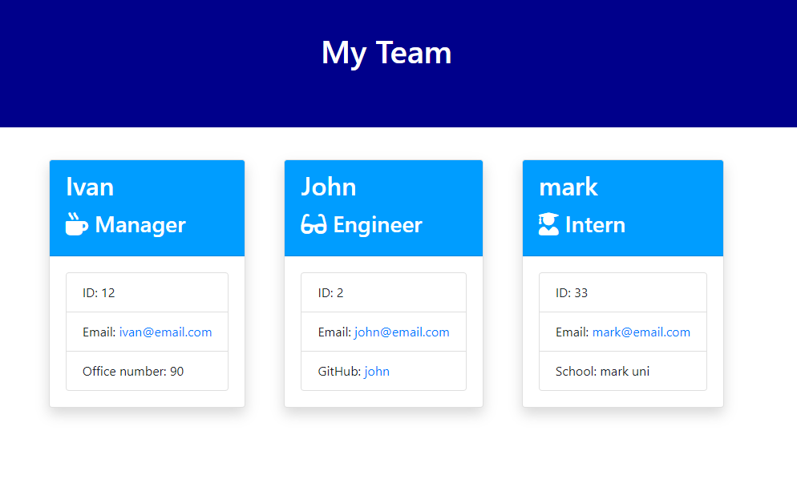

# Engine Employee Summary

## Description 
 
The Engine Employee Summary allows the user to create the profile of each team member and add unique properties about each employee depending on their role.  

## Table of Contents 

* [Usage](#usage-information) 

* [Installation](#installation-instructions) 

* [Where to Contribute](#where-to-contribute) 

* [Repository](#repository) 

* [URL](#url) 

* [Questions](#questions) 

* [Screenshot](#screenshot) 

## Usage Information 
 
To run this applicaton, ensure the code editor (such as VS Code) that has Node.js installed. Proceed to open Terminal (in Mac or VS Code) or Git (if using Windows) and, after reaching the correct path, type 'node app' and hit 'Enter'. A set of questions will be prompted and ensure the email address is in this format (email@email.com) to pass validation. Once the application finishes running, the team.html file will be generated in the 'Output' folder.  

## Installation Instructions 
 
    npm i 

    
## Where to Contribute 
 
Any contribution requests may be done to the GitHub account below. 

## Repository 
 
This repository is hosted in GitHub and you may access it at [https://github.com/johnsbrook/08_Engine_Employee_Summary/](https://github.com/johnsbrook/08_Engine_Employee_Summary/). 

## URL 
 
[https://johnsbrook.github.io/08_Engine_Employee_Summary/app.js](https://johnsbrook.github.io/08_Engine_Employee_Summary/app.js) 

[YouTube Video Demostration](https://youtu.be/6Sb9HOwhUlE)

## Questions 
 
GitHub: [johnsbrook](https://github.com/johnsbrook) 
 
Email: [ivan.zapata.rivera@gmail.com](mailto:ivan.zapata.rivera@gmail.com)

## Screenshot 
 
 
 
